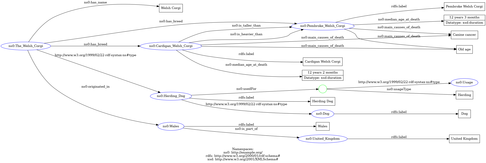

# HW1 - RDF Graph

## Task 1: Text to RDF
Text source: https://en.wikipedia.org/wiki/Welsh_Corgi
```
The Welsh Corgi is a small type of herding dog that originated in Wales.
Two separate breeds are recognized: the Pembroke Welsh Corgi and the Cardigan Welsh Corgi.
According to the breed standards, overall the Cardigan is larger, both in weight and height.
The two breeds of Welsh Corgis, the Cardigan and the Pembroke, are named for the counties in Wales where they originated.
The median age at death was 12 years 3 months for Pembrokes, and 12 years 2 months for Cardigans.
The main causes of death were similar in both breeds; the primary causes were canine cancer and old age.
```

RDF graph generated using: https://www.ldf.fi/service/rdf-grapher

## Task 2: Serialize the graph
Validated using: https://www.w3.org/2015/03/ShExValidata/
### N-triples
```
<http://example.org/The_Welsh_Corgi>        <http://example.org/has_name>                       "Welsh Corgi" .
<http://example.org/The_Welsh_Corgi>        <http://example.org/has_breed>                      <http://example.org/Pembroke_Welsh_Corgi>   .
<http://example.org/Pembroke_Welsh_Corgi>   <http://www.w3.org/2000/01/rdf-schema#label>        "Pembroke Welsh Corgi" .
<http://example.org/The_Welsh_Corgi>        <http://example.org/has_breed>                      <http://example.org/Cardigan_Welsh_Corgi>   .
<http://example.org/Cardigan_Welsh_Corgi>   <http://www.w3.org/2000/01/rdf-schema#label>        "Cardigan Welsh Corgi" .
<http://example.org/Cardigan_Welsh_Corgi>   <http://example.org/is_taller_than>                 <http://example.org/Pembroke_Welsh_Corgi> .
<http://example.org/Cardigan_Welsh_Corgi>   <http://example.org/is_heavier_than>                <http://example.org/Pembroke_Welsh_Corgi> .
<http://example.org/The_Welsh_Corgi>        <http://www.w3.org/1999/02/22-rdf-syntax-ns#type>   <http://example.org/Herding_Dog> .
<http://example.org/Herding_Dog>            <http://www.w3.org/2000/01/rdf-schema#label>        "Herding Dog" .
<http://example.org/Herding_Dog>            <http://www.w3.org/1999/02/22-rdf-syntax-ns#type>   <http://example.org/Dog> .
<http://example.org/Dog>                    <http://www.w3.org/2000/01/rdf-schema#label>        "Dog" .
<http://example.org/Cardigan_Welsh_Corgi>   <http://example.org/median_age_at_death>            "12 years 2 months"^^<http://www.w3.org/2001/XMLSchema#duration> .
<http://example.org/Pembroke_Welsh_Corgi>   <http://example.org/median_age_at_death>            "12 years 3 months"^^<http://www.w3.org/2001/XMLSchema#duration> .
<http://example.org/Cardigan_Welsh_Corgi>   <http://example.org/main_causes_of_death>           "Canine cancer" .
<http://example.org/Pembroke_Welsh_Corgi>   <http://example.org/main_causes_of_death>           "Canine cancer" .
<http://example.org/Cardigan_Welsh_Corgi>   <http://example.org/main_causes_of_death>           "Old age" .
<http://example.org/Pembroke_Welsh_Corgi>   <http://example.org/main_causes_of_death>           "Old age" .
<http://example.org/The_Welsh_Corgi>        <http://example.org/originated_in>                  <http://example.org/Wales> .
<http://example.org/Wales>                  <http://www.w3.org/2000/01/rdf-schema#label>        "Wales" .
<http://example.org/Wales>                  <http://example.org/is_part_of>                     <http://example.org/United_Kingdom> .
<http://example.org/United_Kingdom>         <http://www.w3.org/2000/01/rdf-schema#label>        "United Kingdom" .
<http://example.org/Herding_Dog>            <http://example.org/usedFor>                        _:genid1 .
_:genid1                                    <http://www.w3.org/1999/02/22-rdf-syntax-ns#type>   <http://example.org/Usage> .
_:genid1                                    <http://example.org/usageType>                      "Herding" .
```

### Turtle
```
@prefix ns0: <http://example.org/> .
@prefix rdfs: <http://www.w3.org/2000/01/rdf-schema#> .
@prefix xsd: <http://www.w3.org/2001/XMLSchema#> .

<http://example.org/The_Welsh_Corgi>
  ns0:has_name "Welsh Corgi" ;
  ns0:has_breed ns0:Pembroke_Welsh_Corgi, ns0:Cardigan_Welsh_Corgi ;
  a ns0:Herding_Dog ;
  ns0:originated_in ns0:Wales .

ns0:Pembroke_Welsh_Corgi
  rdfs:label "Pembroke Welsh Corgi" ;
  ns0:median_age_at_death "12 years 3 months"^^xsd:duration ;
  ns0:main_causes_of_death "Canine cancer", "Old age" .

ns0:Cardigan_Welsh_Corgi
  rdfs:label "Cardigan Welsh Corgi" ;
  ns0:is_taller_than ns0:Pembroke_Welsh_Corgi ;
  ns0:is_heavier_than ns0:Pembroke_Welsh_Corgi ;
  ns0:median_age_at_death "12 years 2 months"^^xsd:duration ;
  ns0:main_causes_of_death "Canine cancer", "Old age" .

ns0:Herding_Dog
  rdfs:label "Herding Dog" ;
  a ns0:Dog ;
  ns0:usedFor [
    a ns0:Usage ;
    ns0:usageType "Herding"
  ] .

ns0:Dog rdfs:label "Dog" .
ns0:Wales
  rdfs:label "Wales" ;
  ns0:is_part_of ns0:United_Kingdom .

ns0:United_Kingdom rdfs:label "United Kingdom" .
```

### RDF/XML
```xml
<?xml version="1.0" encoding="utf-8" ?>
<rdf:RDF xmlns:rdf="http://www.w3.org/1999/02/22-rdf-syntax-ns#"
         xmlns:ns0="http://example.org/"
         xmlns:rdfs="http://www.w3.org/2000/01/rdf-schema#">

  <rdf:Description rdf:about="http://example.org/The_Welsh_Corgi">
    <ns0:has_name>Welsh Corgi</ns0:has_name>
    <ns0:has_breed rdf:resource="http://example.org/Pembroke_Welsh_Corgi"/>
    <ns0:has_breed>
      <rdf:Description rdf:about="http://example.org/Cardigan_Welsh_Corgi">
        <rdfs:label>Cardigan Welsh Corgi</rdfs:label>
        <ns0:is_taller_than rdf:resource="http://example.org/Pembroke_Welsh_Corgi"/>
        <ns0:is_heavier_than rdf:resource="http://example.org/Pembroke_Welsh_Corgi"/>
        <ns0:median_age_at_death rdf:datatype="http://www.w3.org/2001/XMLSchema#duration">12 years 2 months</ns0:median_age_at_death>
        <ns0:main_causes_of_death>Canine cancer</ns0:main_causes_of_death>
        <ns0:main_causes_of_death>Old age</ns0:main_causes_of_death>
      </rdf:Description>
    </ns0:has_breed>

    <rdf:type>
      <ns0:Dog rdf:about="http://example.org/Herding_Dog">
        <rdfs:label>Herding Dog</rdfs:label>
        <ns0:usedFor>
          <ns0:Usage>
            <ns0:usageType>Herding</ns0:usageType>
          </ns0:Usage>
        </ns0:usedFor>

      </ns0:Dog>
    </rdf:type>

    <ns0:originated_in>
      <rdf:Description rdf:about="http://example.org/Wales">
        <rdfs:label>Wales</rdfs:label>
        <ns0:is_part_of>
          <rdf:Description rdf:about="http://example.org/United_Kingdom">
            <rdfs:label>United Kingdom</rdfs:label>
          </rdf:Description>
        </ns0:is_part_of>

      </rdf:Description>
    </ns0:originated_in>

  </rdf:Description>

  <rdf:Description rdf:about="http://example.org/Pembroke_Welsh_Corgi">
    <rdfs:label>Pembroke Welsh Corgi</rdfs:label>
    <ns0:median_age_at_death rdf:datatype="http://www.w3.org/2001/XMLSchema#duration">12 years 3 months</ns0:median_age_at_death>
    <ns0:main_causes_of_death>Canine cancer</ns0:main_causes_of_death>
    <ns0:main_causes_of_death>Old age</ns0:main_causes_of_death>
  </rdf:Description>

  <rdf:Description rdf:about="http://example.org/Dog">
    <rdfs:label>Dog</rdfs:label>
  </rdf:Description>

</rdf:RDF>
```

## Task 3: Reification
### 1a) Triple
```
<http://example.org/The_Welsh_Corgi> <http://example.org/has_name> "Welsh Corgi" .
```
### 1b) RDF
```
_:reification1 rdf:subject ex:The_Welsh_Corgi .
_:reification1 rdf:predicate ex:has_name .
_:reification1 rdf:object "Welsh Corgi" .

_:reification1 ex:source "https://en.wikipedia.org/wiki/Welsh_Corgi"
_:reification1 ex:publicationDate "2018-05-05"
```
### 1c) RDF-star
```
<<http://example.org/The_Welsh_Corgi> <http://example.org/has_name> "Welsh Corgi"> rdf:subject <http://example.org/The_Welsh_Corgi> .
<<http://example.org/The_Welsh_Corgi> <http://example.org/has_name> "Welsh Corgi"> rdf:predicate <http://example.org/has_name> .
<<http://example.org/The_Welsh_Corgi> <http://example.org/has_name> "Welsh Corgi"> rdf:object "Welsh Corgi" .

<<http://example.org/The_Welsh_Corgi> <http://example.org/has_name> "Welsh Corgi"> ex:source <https://en.wikipedia.org/wiki/Welsh_Corgi> .
<<http://example.org/The_Welsh_Corgi> <http://example.org/has_name> "Welsh Corgi"> ex:publicationDate "2018-05-05"
```
### 2a) Triple
```
<http://example.org/The_Welsh_Corgi> <http://example.org/originated_in> <http://example.org/Wales> .
```
### 2b) RDF
```
_:reification2 rdf:subject ex:The_Welsh_Corgi .
_:reification2 rdf:predicate ex:originated_in .
_:reification2 rdf:object ex:Wales .

_:reification2 ex:source "https://en.wikipedia.org/wiki/Welsh_Corgi"
_:reification2 ex:context "History"
_:reification2 ex:publicationDate "2018-05-05"
```
### 2b) RDF-star
```
<<http://example.org/The_Welsh_Corgi> <http://example.org/originated_in> <http://example.org/Wales>> rdf:subject <http://example.org/The_Welsh_Corgi> .
<<http://example.org/The_Welsh_Corgi> <http://example.org/originated_in> <http://example.org/Wales>> rdf:predicate <http://example.org/originated_in> .
<<http://example.org/The_Welsh_Corgi> <http://example.org/originated_in> <http://example.org/Wales>> rdf:object <http://example.org/Wales> .

<<http://example.org/The_Welsh_Corgi> <http://example.org/originated_in> <http://example.org/Wales>> ex:source "https://en.wikipedia.org/wiki/Welsh_Corgi"
<<http://example.org/The_Welsh_Corgi> <http://example.org/originated_in> <http://example.org/Wales>> ex:context "History"
<<http://example.org/The_Welsh_Corgi> <http://example.org/originated_in> <http://example.org/Wales>> ex:publicationDate "2018-05-05"
```
### 3) Triple
```
<http://example.org/The_Welsh_Corgi> <http://example.org/has_breed> <http://example.org/Pembroke_Welsh_Corgi> .
```
### 3) RDF
```
_:reification3 rdf:subject ex:The_Welsh_Corgi .
_:reification3 rdf:predicate ex:has_breed .
_:reification3 rdf:object ex:Pembroke_Welsh_Corgi .

_:reification3 ex:source "https://en.wikipedia.org/wiki/Welsh_Corgi"
_:reification3 ex:context "Modern breeds"
_:reification3 ex:publicationDate "2023-10-30"
```
### 3) RDF-star
```
<<http://example.org/The_Welsh_Corgi> <http://example.org/has_breed> <http://example.org/Pembroke_Welsh_Corgi>> rdf:subject <http://example.org/The_Welsh_Corgi> .
<<http://example.org/The_Welsh_Corgi> <http://example.org/has_breed> <http://example.org/Pembroke_Welsh_Corgi>> rdf:predicate <http://example.org/has_breed> .
<<http://example.org/The_Welsh_Corgi> <http://example.org/has_breed> <http://example.org/Pembroke_Welsh_Corgi>> rdf:object <http://example.org/Pembroke_Welsh_Corgi> .

<<http://example.org/The_Welsh_Corgi> <http://example.org/has_breed> <http://example.org/Pembroke_Welsh_Corgi>> ex:source "https://en.wikipedia.org/wiki/Welsh_Corgi"
<<http://example.org/The_Welsh_Corgi> <http://example.org/has_breed> <http://example.org/Pembroke_Welsh_Corgi>> ex:context "Modern breeds"
<<http://example.org/The_Welsh_Corgi> <http://example.org/has_breed> <http://example.org/Pembroke_Welsh_Corgi>> ex:publicationDate "2018-05-05"
```
