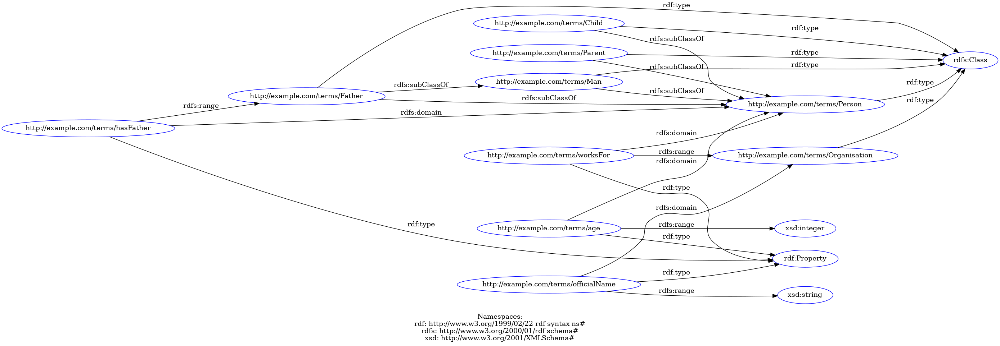
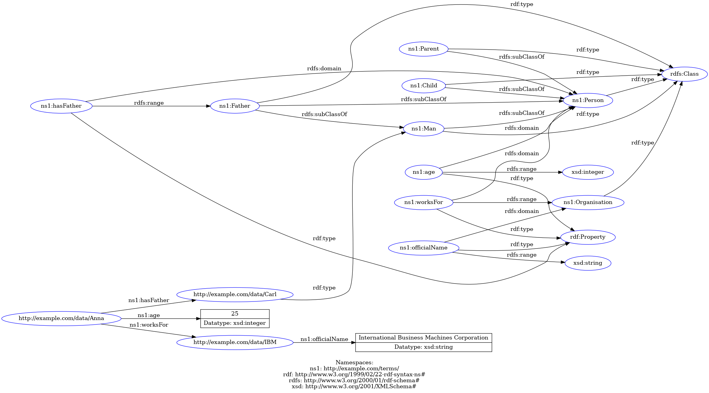
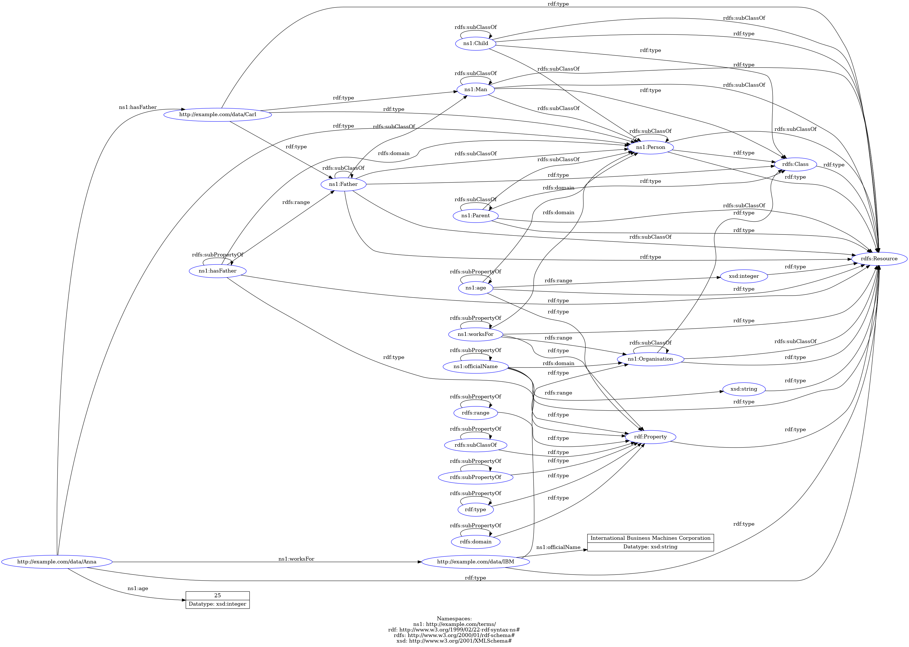

# HW2 - Ontology Modelling

### 0. [Implementation](src/main.py)
### 1. [RDF graph containing only the vocabulary definitions](results/rdf_vocabulary.ttl)

### 2. [RDF graph (vocabulary and instance data) (before reasoning)](results/rdf_vocabulary_and_data.ttl)

### 3. [inferred RDF graph (after reasoning)](results/rdf_vocabulary_and_data_and_reasoning.ttl)

#### 3.5 extract and list few triples from the inferred model that are new and interesting (meaningful for use)
* Anna is a person `<http://example.com/data/Anna> rdf:type ns1:Person .`
* Carl is a person `<http://example.com/data/Carl> rdf:type ns1:Person .`
* Carl is a father `<http://example.com/data/Carl> rdf:type ns1:Father .`
* IBM is an Organisation `<http://example.com/data/IBM> rdf:type ns1:Organisation .`

